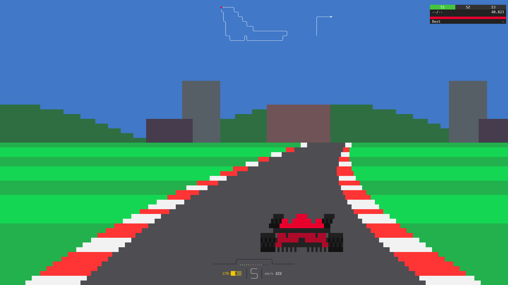

# ${{\color{Red}\Huge\textsf{Formula 1}}}\$ ${{\Huge\textsf{Console Racing}}}\$



## Overview
Terminal-based racing game featuring a simple control system and lap timing

## Features
- **Monza Circuit**
- **WASD Controls**
- **Sector Timing & Best Laps** – track your best lap times with sector indicators
- **Basic Gear System** – automatic shifting and reverse gear mechanics
- **HUD & Track Map** – displays speed, gear and track position on map

## Controls
```
                                               ╭─────╮                         
 W - Accelerate                                ╰╮    ╰─╮
 A - Turn Left                                  │      ╰─╮                       
 D - Turn Right                                 ╰╮       ╰─╮                  
 S - Brake                                       │         ╰──╮
                                                 │            ╰───────────────╮
 R - Toggle Reverse Gear                         ╰─╮      ╭╮                ╭─╯
                                                   ╰──────╯╰────────────╌───╯  
```

## Running the Game
```bash
https://github.com/Ereklewoxo/Formula-1-Console-Racing.git
```
Run with Visual Studio

## Technical Stuff
- **Rendering System** – uses mostly background color changes instead of characters for efficiency
- **Audio** – robotic engine sound generated using Nsound
- **Input Handling** – uses `GetAsyncKeyState` for real-time responsiveness

${{\color{MediumSpringGreen}● ● ● ● ●}}\$ ${{\color{Red}● ● ● ● ●}}\$ ${{\color{MediumSlateBlue}● ● ● ● ●}}\$

This game is not a realistic simulation. Aspects, like car positioning for corners and engine behavior are simplified and not realistic. The shift lights are also 14 instead of 15 for symmetry.
